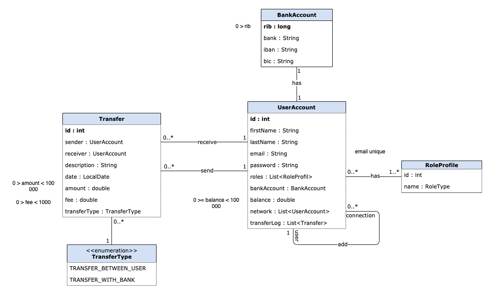

# Pay My Buddy - work in progress
Pay My Buddy allows user to simply transfer money to other friends through the application.

## Information
* Author : Noémie BARRAL - DA Java Student - OpenClassrooms
* Release date : 30 mars 2021

### Running Application
* The application works on port 8080
* The application works with a MySQL database on port 3306
* Before running, add username and password access for database in application.properties
* Run script create_database.sql before the first use.
* For demo version, the SetUpDataLoader class create 1 user and 1 admin. Suppress the TODO part before production.

### Running Tests
* Before running, add username and password access for database in integration-test.properties
* Run script create_db_test.sql before running tests for the first time.
* Script create_default_value.sql is automatically managed by tests and will add default values for testing.

## Business Logic
In this application version, we consider that only one bank account is available per user.

The user can transfer money from its account to its bank but the feature to add money on its account is not already available.

### Class diagram

### Data model

## Content

### Release ###

The first release v.1.0 contains :
* Endpoints to manage user account and make transfer
* Endpoints to get admin information
* Security filter and authentication with username and password
* Security role depending on path

This release does not contain :
* Front-end
* OAuth token for external connexion (ex : Facebook)

### Endpoints

#### SignUp

***POST*** - http://localhost:8080/signup

* Create a new user account

#### Profile

***GET*** - http://localhost:8080/profile

* Get my account information as user

***PUT*** - http://localhost:8080/profile

* Update my account information as user

***DELETE*** - http://localhost:8080/profile

* Delete my account as user

***GET*** - http://localhost:8080/profile/connections

* Get all user in my network as user

***PUT*** - http://localhost:8080/profile/connections

* Add a new connection to my network as user

***PUT*** - http://localhost:8080/profile/connections/{connectionId}

* Delete a connection from my network as user

***GET*** - http://localhost:8080/profile/transfers

* Get all my transfer log as user

#### Transfer

***POST*** - http://localhost:8080/transfers

* Send a transfer to another user or to my account as user

***GET*** - http://localhost:8080/transfers

* Get all my transfers as sender and user

***GET*** - http://localhost:8080/transfers/{transferId}

* Get all information about a specific transfer as user and sender or receiver

#### Admin

***GET*** - http://localhost:8080/admin/users

* Get all user accounts information as admin

***GET*** - http://localhost:8080/admin/transfers

* Get all transfers information as admin

### Fixing

* Currently, when suppress a user account, all transfers linked to this user are suppressed too. Need to find a solution to keep transfers log safe.